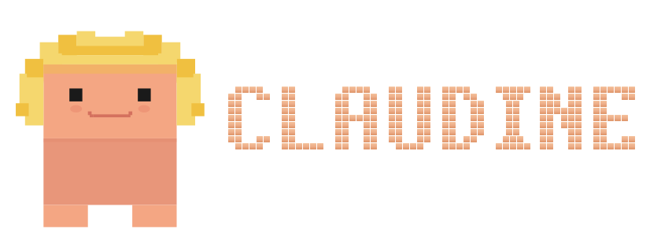

# Who is Claudine?
Claudine is an addition (maybe one day I'll be able to call it a plugin) to Claude, with the intention of using it with Claude Code.
## How is Claudine built?
Claudine consists of many pieces, that are supposed to enhance Claude's abilities regardless of the model you're using to do your work. A great part of those pieces are inspired by other creators on GitHub and re-done to match Claudine's style and harnessing mechanisms. You'll find the creator or inspiration sources of each item that was used, in a comment next to the part reused or redone from. 
## Why the name?
As most things in this repository, Claudine's name has been blatantly stolen and slightly redone, based on [Sylwia's](http://behance.net/sforysinska) name for her Figma Make pet.
## Where's she from?
I have started working on Claudine while on a journey of learning how to use AI. I was the guy who when ChatGPT first boomed was looking down at people using it with pity, but as time went by and I used more tools, from GPT, through Gemini, Perplexity, Grok, Nano Bananas, Eleven Labs and ending with my beloved Claude, I am contiuously being amazed with the possibilities this techology gives to humanity. I do not believe AI will anytime soon replace humans. I do not believe in AI without human proofchecking and supervision. I do believe people can more than double the amount of work and research performed in a set timeframe using current-day LLMs.
### Why the coding skills?
While most people before they were born, were standing in queue to get the skill of focusing on a single thing at once, a higher power has given me the ability to understand code. This is a blessing in disguise - I cannot code and I don't want to learn how to do it, it seems boring to me and I have no desire whatsoever to become a developer. However, code is clear in most cases to me in terms of the logic it operates on, so I . Also, because I've been standing in the wrong queue, I can't stand working on one thing and I'd much rather have 17 project simultaneously. AI finally allows this preference to be feasible without having to lose any work quality, that you normally would because of the cost of context switching.
### Meet The Maker
I am a Project Manager with extensive experience in Software House environments. Due to my profession, Claudine has originally been created to free my time from duties outside of client and team meetings. Using Claude with Claudine and a plethora of external tools I continue to delegate the ant-work of writing things down and contemplating on "what did the client mean?" to the AI that doesn't get bored and/or tired of this shizz. I can then focus on being my most creative and sociable self, bringing more value to my workspace than being a notetaker on payroll.
### though...
Very important: I am not a Software Engineer, although I do work with Software Engineering. Most of the development-related skills and additions in this repository are consulted with Engineers and/or battle-tested, however please do take caution with the code, that Claude writes, even when using Claudine. It may (and should) enhance Claude's abilities, but it may just as well encourage it to break stuff. This is a continuous work in progress, as is the case with most things AI-related. Results of your work conducted with AI should be checked by a human. I know you don't wanna, I don't either.
### My CC Setup
For a statusbar, I use https://github.com/rz1989s/claude-code-statusline with just a vanilla install.
By rule, I do not install plugins to Claude to widen it's possibilities. When I find something interesting and using public domain, I add it to Claudine and test it in one of it's forks.
# Usage
Claudine is meant to be used with Anthropic's Claude Code. I am biased, it is the only AI I'm using on a day-to-day basis. Feel free to fork Claudine and adjust it to work with your tool of choice, but I do not take any responsibility for how it works outside of the Claude environment. For how it works in it, I also don't take reponsiblity, but I sure hope it works okay, so I can use it myself.
### Limitations
Claudine was created for use with Claude Max 20x model. Lower limits may not be sufficient to handle flow that Claudine enforces and works in.
## You may want to change things
Claudine is my personal toy. Be aware, that it contains configuration that may not be of your preference. If you don't like something feel free to delete it from your local version of Claudine. This system is meant to be fully modular, but do refer to the workflows section and find all references in the code of what you're deleting, so you can be sure that the rest of the system remains intact.
## This isn't a product by itself
Claudine is not directly connected to any one project. I am commiting to this repository as I work on projects using a fork of Claudine with changes and discoveries as I go through those projects. Claudine is not a stand-alone system and does not solve any problems by itself. My understanding and goal of developing Claudine is to have a system that you (and I) can fork, run a single /claudine-adjust in the right project and have the entire flow reworked to match exactly what you're working on. 
## Garbage in, garbage out
I work with AI as an input-output system, believing that if you supply it garbage, it will throw out garbage (I've taken this quote from [Aleksander Patschek](https://patschek.dev/) in one of his TSH's materials). Because of this, I don't think there is any one system/agent/prompt to solve the world's problems, but that you have to adjust your entire system to the exact project you're working with the system on. Another result of this approach is that Claudine encourages the user to attach high-quality input and Claude to both require this input and product even more high-quality outcome based on the data received. This will be further described. Be aware that if you don't know what you're doing, AI will help you find it out, but if you try to implement the work without knowing what you're trying to achieve, AI will most likely deceive you and you will end up exactly where you started.
## Ongoing development
Claudine is being developed iteratively.
# Credits
## Partial co-creators
Shoutout to every creator, that commited and shared their work either to be a part or to inspire the functionalities of Claudine.
## My projects from and for Claudine
Feel free and encouraged, to check the projects that are being developed with Claudine, and because of/using which, Claudine has been created and is being continuously improved.
## Changes
I consider Claudine public good, it can be used to move faster in terms of the ever-changing reality of our AI usage in day-to-day responsibilities. As such, feel free to explore and create your versions of Claudine and commit or create an issue for changes you'd like to make to my OG version of Claudine. I am actively monitoring and expanding the possibilities of this system, I'd be honored to have your involvement in this endeavour.
