# Claudine Flow Diagrams

## How to Read These Diagrams

All diagrams use Mermaid syntax. To render them:
- Paste into any Mermaid renderer (mermaid.live, GitHub markdown, VS Code plugin)
- Rectangles = processes/agents
- Diamonds = decisions
- Parallelograms = inputs/outputs
- Cylinders = data stores
- Arrows = data flow direction

---

## Table of Contents

1. [The Company Org Chart](#1-the-company-org-chart)
2. [The Primitive Hierarchy](#2-the-primitive-hierarchy)
3. [The Activation Chain](#3-the-activation-chain)
4. [The Self-Improvement Loop](#4-the-self-improvement-loop)
5. [Flow: Bug Fix (Waterfall)](#5-flow-bug-fix-waterfall)
6. [Flow: Full Audit (Swarm)](#6-flow-full-audit-swarm)
7. [Flow: New Feature (Hybrid)](#7-flow-new-feature-hybrid)
8. [Flow: Sprint Planning](#8-flow-sprint-planning)
9. [Flow: Release Preparation](#9-flow-release-preparation)
10. [Flow: Project Onboarding (/cne-cmd-core-adjust)](#10-flow-project-onboarding)
11. [Flow: Self-Improvement (/cne-cmd-core-improve)](#11-flow-self-improvement)
12. [The Master Flow Map](#12-the-master-flow-map)
13. [Data Flow: Context Propagation](#13-data-flow-context-propagation)

---

## 1. The Company Org Chart

This is Claudine as a company. Every department, every employee, every role.

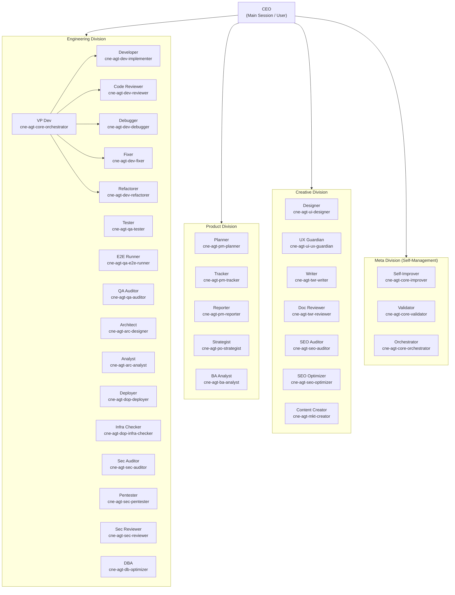

---

## 2. The Primitive Hierarchy

How Claude Code primitives relate to each other and to the company metaphor.

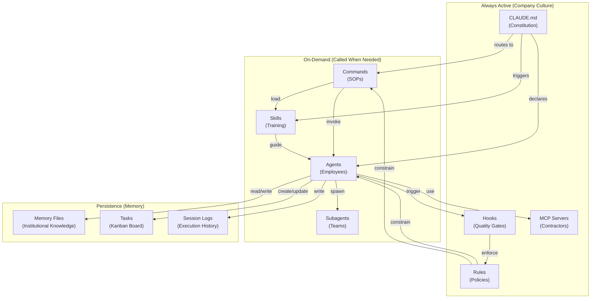

---

## 3. The Activation Chain

What happens when a user makes a request -- the complete flow from input to output.

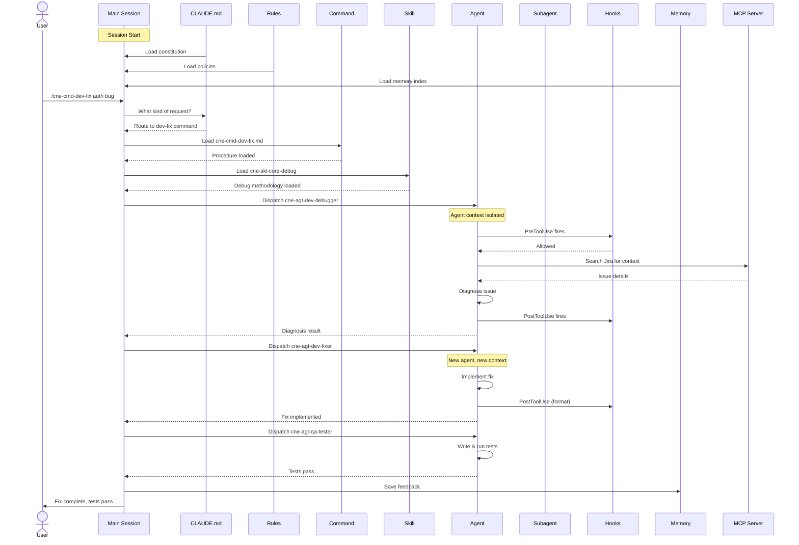

---

## 4. The Self-Improvement Loop

How Claudine gets better over time.

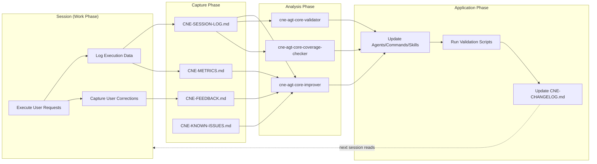

---

## 5. Flow: Bug Fix (Waterfall)

The `/cne-cmd-dev-fix` command -- a pure waterfall flow.

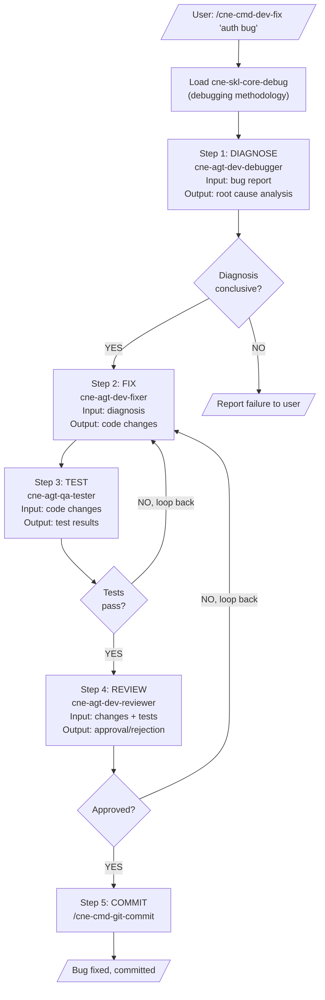

---

## 6. Flow: Full Audit (Swarm)

The `/cne-cmd-qa-audit` command -- a pure swarm flow with consolidation.

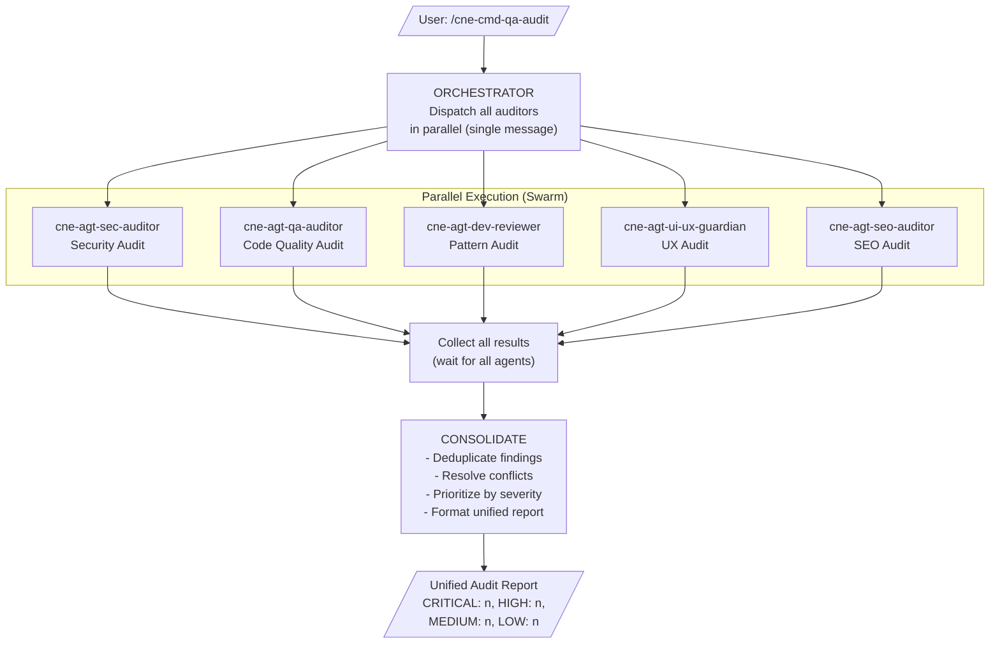

---

## 7. Flow: New Feature (Hybrid)

The `/cne-cmd-dev-feature` command -- waterfall phases with swarm sub-phases.

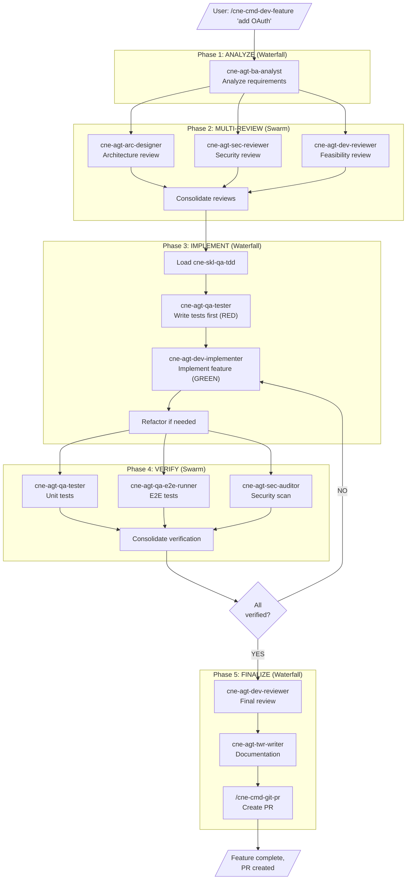

---

## 8. Flow: Sprint Planning

The `/cne-cmd-pm-sprint` command -- waterfall with information gathering.

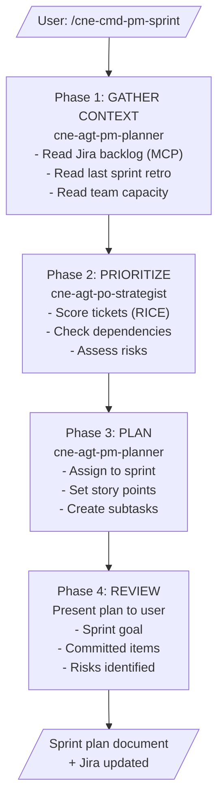

---

## 9. Flow: Release Preparation

The `/cne-cmd-dop-release` command -- hybrid flow.

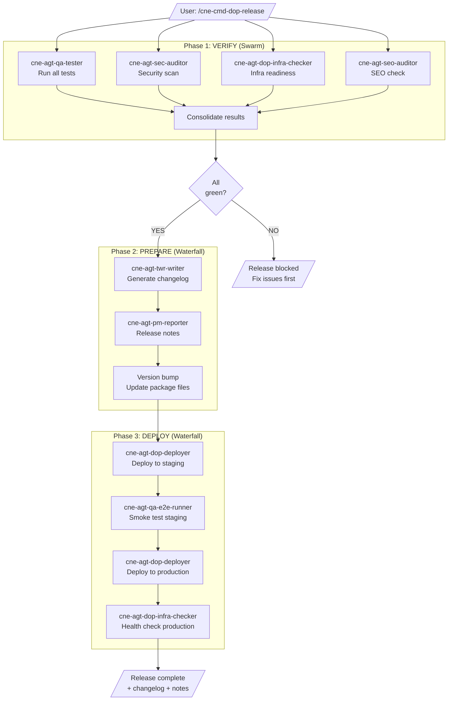

---

## 10. Flow: Project Onboarding

The `/cne-cmd-core-adjust` command -- adapting Claudine to a new project.

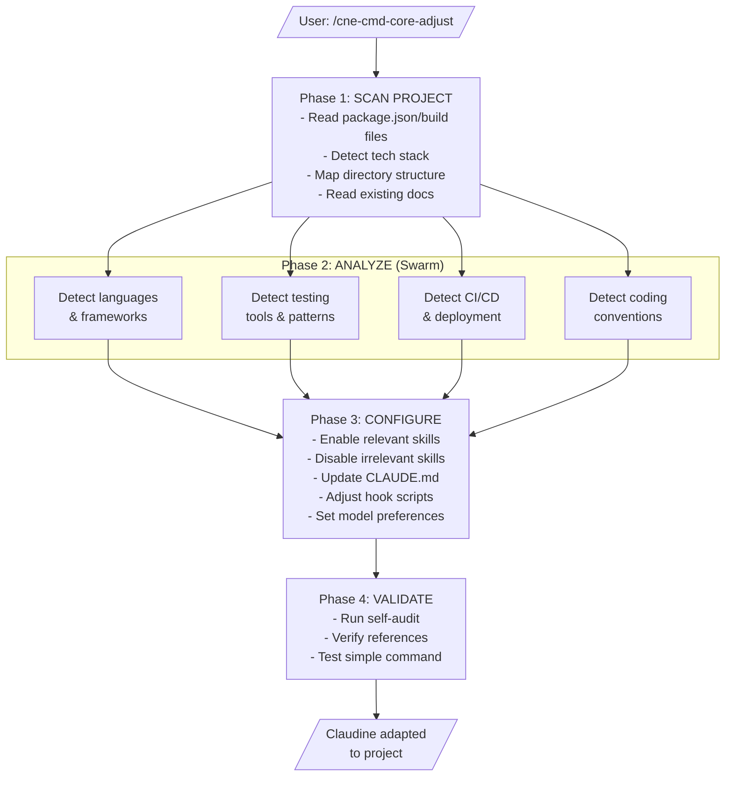

---

## 11. Flow: Self-Improvement

The `/cne-cmd-core-improve` command -- Claudine improving itself.

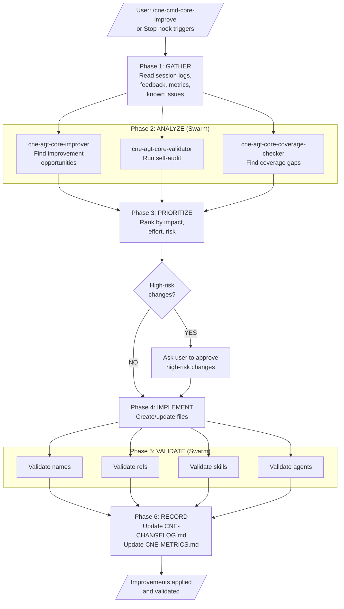

---

## 12. The Master Flow Map

All Claudine flows and how they connect to each other. This is the complete "company operations map."

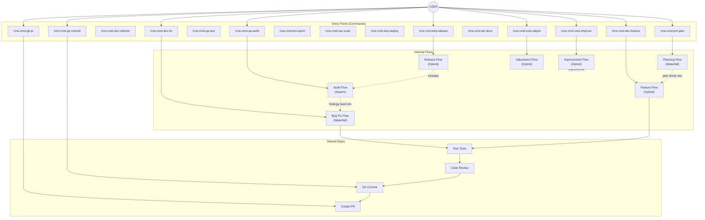

---

## 13. Data Flow: Context Propagation

How data moves between agents, showing what each agent can and cannot see.

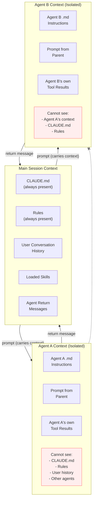

**Key Insight**: Agents are blind to each other and to the main session's accumulated context. The orchestrator (main session) is the ONLY entity that sees everything. It must explicitly include relevant context in each agent's prompt.

---

## Pattern Legend

Use this legend when creating new flow diagrams:

| Shape | Meaning |
|---|---|
| Rectangle | Process / Agent execution |
| Diamond | Decision gate |
| Parallelogram | Input / Output |
| Rounded rectangle | Subgraph / Phase boundary |
| Solid arrow | Data flow / sequence |
| Dashed arrow | Indirect relationship / feeds into |
| Circle | User / external entity |

| Color | Meaning |
|---|---|
| Default (blue) | Normal process |
| Red (#fee) | Warning / cannot-do |
| Green | Success path |
| Orange | Caution / requires approval |

---

## 14. Flow Selection Decision Tree

When a user makes a request, use this tree to determine which command/flow applies:

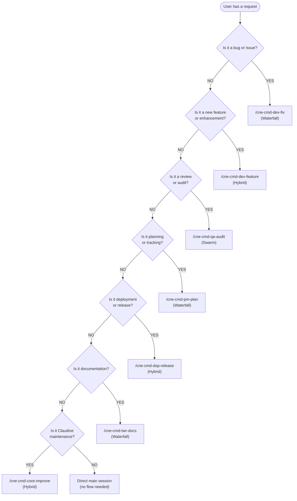

---

## 15. Memory System Lifecycle

How institutional memory is read, written, and connects to sessions:

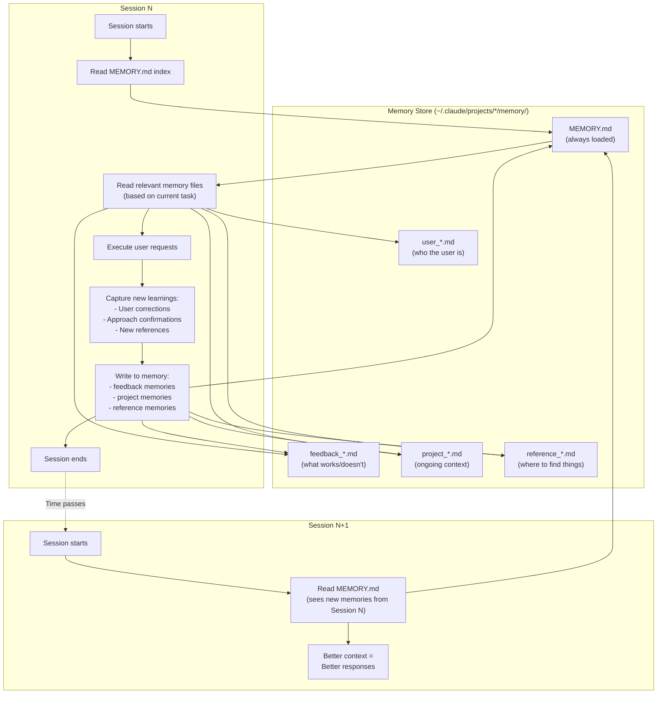

---

## 16. The Voting Swarm Pattern

For high-stakes decisions where multiple independent opinions are needed:

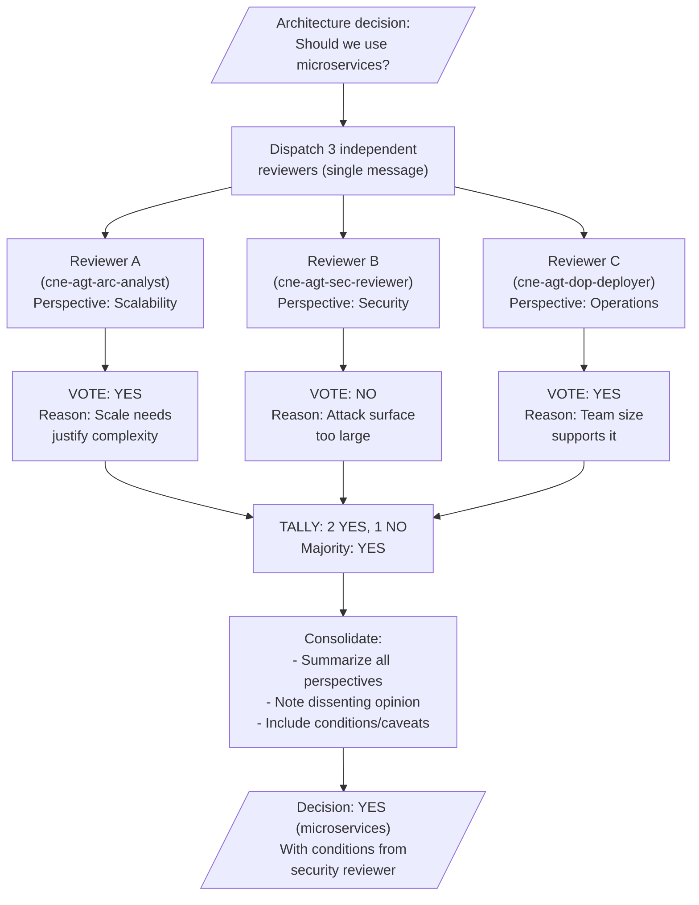
